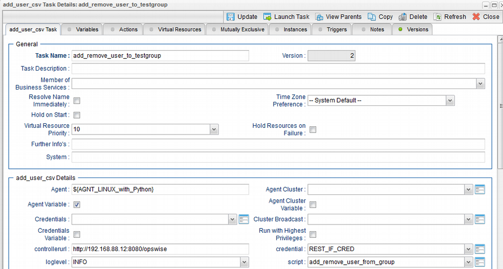

# ut-add-user-csv-linux
This Universal Task allows to mass add and remove users from a Universal Controller Group. The data to add and/or remove users from a group is provided by a CSV file loaded to the Universal Controller script library.

# Abstract: 

This Universal Task allows to mass add and remove users from a Universal Controller Group. The data to add and/or remove users from a group is provided by a CSV file loaded to the Universal Controller script library. 

# 1	Disclaimer

No support and no warranty are provided by Stonebranch GmbH for this document and the related Universal Task. The use of this document
and the related Universal Task is on your own risk. 

Before using this task in a production system, please perform extensive testing. 

Stonebranch GmbH assumes no liability for damage caused by the performance of the Universal Tasks

# 2	Introduction

The here described Universal Task allows to mass add and remove users from a Universal Controller Group. The data to add and/or remove 
users from a group is provided by a CSV file loaded to the Universal Controller script library. The Universal Task uses the REST API of 
the Universal Controller to add and remove users from a group. The Rest API commands are executed using the Python requests module. 

Some details about the universal task to add and remove users from a group: 
    - The Universal Task uses the REST API of the Controller to add and remove users 
    - The User to add and remove from a group are provided by CSV file loaded to the Universal Controller Script library 
    - The Universal Task supports both Universal Agent for Linux/Unix and Windows 
    - You can select different log-levels e.g. Info and debug 
    - All Passwords are encrypted using Controller Credentials 
    
# 3	Installation

# 3.1	Requirements for Linux Agent

Universal Template name: ut-add-user-csv-linux

Related UAC XML Files for template and task: [1]: 
-	Python 2.7.x installed on a Linux server where a Universal Agent is installed. 
-	For Python the following modules are required: 
    -	sys, for output re-direct processing
    -	datetime, date and time stamps for messages
    -	requests to perform the REST API calls
    -	logging, for python loglevel support
    -	CSV, to parse the input file
-	Universal Controller V6.4.7.0 or higher
-	Universal Agent V6.4.2.2 or higher installed on a Linux Server

# 3.2	Installation Steps

The following describes the installation steps:

**1.	Install Python 2.7.x  for Linux on any Linux Server running a Universal Agent**

Official Download link: https://www.python.org/downloads/ 
Note: The check the current Python Version type in a shell: python -V (capital V) 

**2. Add the required python modules**

In a command shell as sudo or root: 
    - pip install requests 
 
It is assumed that the modules logging, sys, datetime are already available. If not install them via pip. 
 
**3.	Import the Universal Task including the Universal Template to your Controller**

Go to “All Tasks” and load via the Import functionality the Universal Task configuration into the Controller. 

# 4	Universal Task Configuration

**1.	Activate: Resolvable Credentials in Universal Automation Center properties:**

**2.	Create the CVS file to addand remover user**

You can copy and paste the CSV to the script library or load a CSV from an external file.
The CSV file has the following structure:
USER,GROUP,[Add|Delete] 
testuser1,testgroup,Add 
testuser2,testgroup,Add 
testuser3,testgroup,Delete 

**Example:**

**3.	Fill Out the Universal Task to add and remover users from group**

**Credential for Universal Task:**

**Task Output:**

**Description:**

# 5	Test Cases

The following basic test cases has been performed:

# 6	Document References

This document references the following documents:

